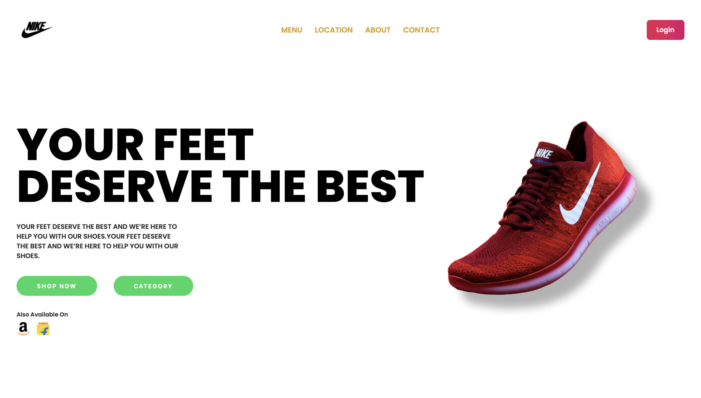

# Nike Shoe Landing Page



## Overview

This project is a React-based Nike Shoe Landing Page that showcases a sleek and modern design for presenting Nike shoes. It is a responsive and visually appealing web page that can be used as a template for showcasing different shoe models.

## Features

- **Responsive Design:** The landing page is designed to work seamlessly on various devices, including desktops, tablets, and smartphones.
- **Product Showcase:** The page includes a preview image of a Nike shoe (src: ./public/product.png), providing users with a visual representation of the featured product.
- **Interactive Components:** Utilizes React components to create an interactive and engaging user experience.

## Getting Started

To get started with this project, follow these steps:

1. **Clone the repository:**

   ```bash
   git clone https://github.com/Syntax-Error-1337/Landing_Page_Nike.git

2. **Navigate to the project directory:**
   ```bash
   cd Landing_Page_Nike
   
3.  **Install dependencies:**
    ```bash
   npm Install

4.  **Run the development server:**
    ```bash
   npm run dev
   
## Customization
Feel free to customize the content, styles, and components to fit your specific needs. Update the product image, modify the text, and experiment with different styles to create your unique Nike Shoe Landing Page.
## Contributing
If you find any issues or have suggestions for improvement, please open an issue or create a pull request. Contributions are welcome!


   
   
